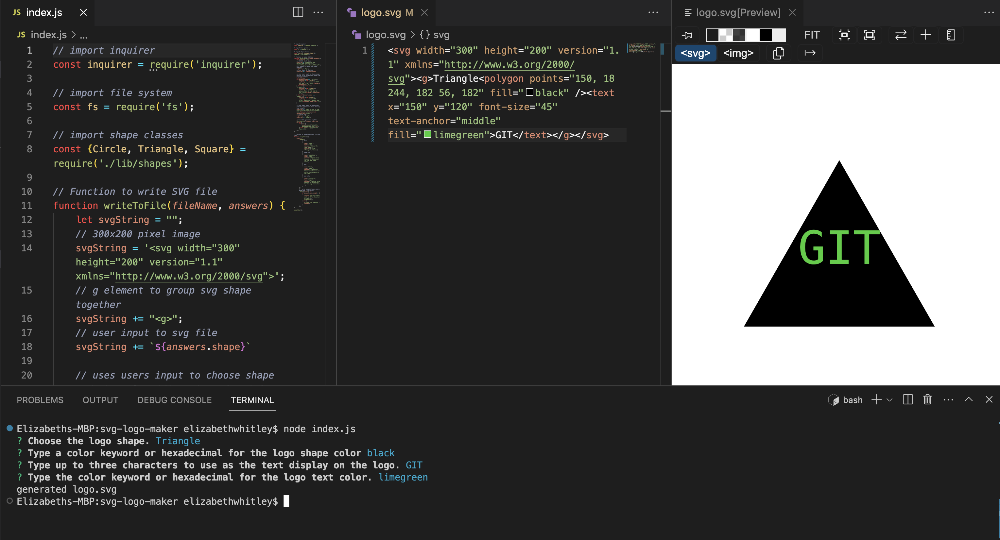

# Challenge 10: SVG Logo Maker 

## Description
The purpose of this application was to create a simple logo generator using Node JS. The application functions through Node JS command line using Inquirer for collecting input from the user to generate a logo to be saved as an SVG file. The user can select a logo shape (circle, triangle, or square), a shape color, add text to the logo (must be three characters or less), and change the text color.

Watch a walkthrough [video](https://drive.google.com/file/d/1PcJ1v1PY14JT5l4VSkEcgZ-DhHoauW6O/view?usp=sharing) demonstrating the functionality of the application and its tests.

  ## Table of Contents
  * [Installation](#installation)
  * [Usage](#usage)
  * [License](#license)
  * [Badges](#badges)
  * [Contributions](#contributions)
  * [Tests](#tests)
  * [Questions](#questions)

## [Installation](#Table-of-Contents)
1. Install 'node.js' https://nodejs.org/en/download.
2. Install inquirer by typing `npm i inquirer` in the terminal's command line.
3. Clone this repo to your local computer https://github.com/lizf57/svg-logo-maker.
4. Install dependencies by typing `npm install` in the terminal's command line.
5. Install devDependencies by typing `npm install --save-dev jest` in the terminal's command line.

## [Usage](#table-of-contents)
To invoke the application, type `node index.js` on the command line. After hitting enter, the user will be prompted a series of 4 messages to customize their logo: 
* Choose the logo shape: circle , triangle, or square.
* Type the color keyword or hexadecimal for the logo shape color.
* Type up to three characters to use as the text display on the logo.
* Type the color keyword or hexadecimal for the logo text color.

If the user enters more than three characters for the text display on the logo, the user will receive a prompt stating "text value must be three characters or less" and the user will answer the 4 prompts again.
 
 
Once the user completes the prompts correctly, a logo will be generated in the directory under the file name 'logo.svg.'

## [License](#table-of-contents)
[MIT License](https://opensource.org/licenses/MIT)

## [Badges](#table-of-contents)

 

## [Contributions](#table-of-contents)
There were no other developers contributing to this application. The project was initiated as a challenge assignment from the University of Wisconsin Coding Bootcamp. 

## [Tests](#table-of-contents)
This application uses Jest for running tests. Each shape was tested using the render() method. To run the test, open the terminal command line and type `npm run test` or `npm test`.

## [Questions](#Table-of-Contents)
If you have any questions contact me here:

  [GitHub](https://github.com/lizf57)
  
  [Email: lizfriedman5@gmail.com](mailto:lizfriedman5@gmail.com)

